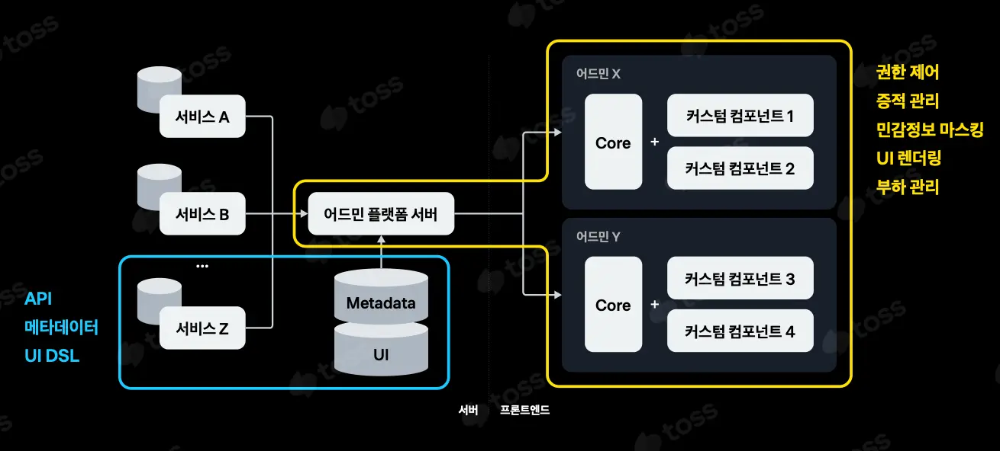

영상: [토스ㅣSLASH 23 - Server-driven UI로 토스의 마지막 어드민 만들기](https://youtu.be/3wxG1WLDONI?si=87pADYXajH6dypYw)

## 해결하려고 했던 문제

### 문제1: 너무 많은 어드민

- 최소 비용으로만 개발되어 불편한 사용성
  - 실무자들의 니즈가 반영되지 못함
- 일관성 없이 파편화된 UI/UX
  - 정해진 규칙이 없다보니 만드는 사람의 취향 반영

### 문제 2: 엄격한 보안 규정

- 마스킹 해야하는 데이터

### 문화와의 호환성

- 작은 목적 조직이 각 제품에 대한 온전한 권한을 갖는 문화
  - 이거는 토스 문화와 연결되는 것으로 보임
- 어드민도 각 조직에서 개발
- 다른 조직에서 비슷한 어드민을 중복 개발
  - 이번 고객 센터 어드민 개발형태가 이러함

## 동작 방식

- UI를 기술하는 Domain Specific Language (DSL) ex. json, yaml
- DSL을 렌더링하는 프론트엔드 엔진
  <!-- {"width":608} -->

## 장점

- 어드민 개발에 리소스를 줄이고 제품 개발에 집중하게 됨
- 신규 어드민 기능 추가 시간 5 ~ 10일 -> 1 ~ 2일

## 단점

- 비싼 초기 개발 비용
  - 약 6개월을 썼다고 함
  - DSL을 정의해야함
  - open source framework(ex. [divkit](https://github.com/divkit/divkit))가 있지만 어드민에 필요한 모든 기능이 있지 않음 ex. 모달

## 조사 내용

- 생각보다 많은 기업이 server driven ui를 사용하고 있음
  - 네이버 lapin, 요기요, 카카오 등등..
- graphql을 쓰기 적합함
  - [graphql 문서](https://www.apollographql.com/docs/graphos/schema-design/guides/sdui/schema-design)
  - [카카오](https://devblog.kakaostyle.com/ko/2021-12-16-1-server-driven-ui)
