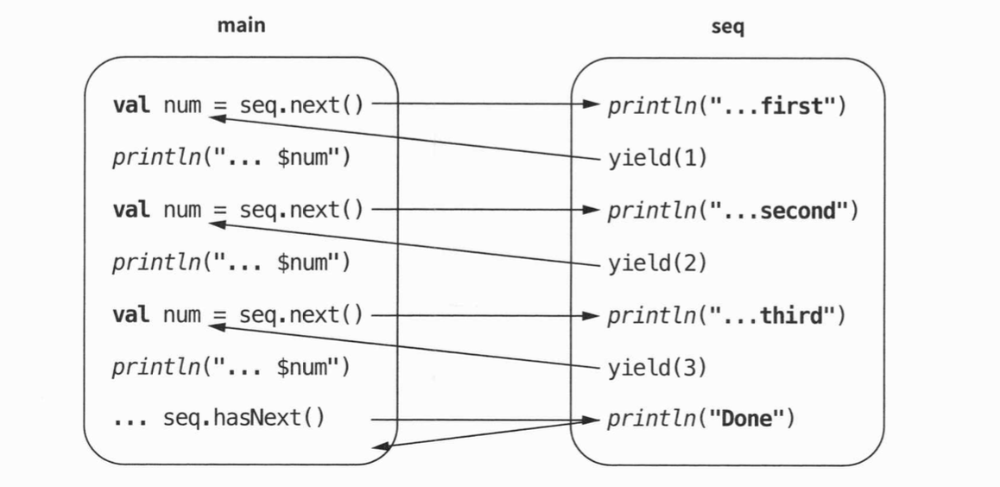

<PostHeader
  :title="$frontmatter.title"
  :author="$frontmatter.author"
  :date="$frontmatter.date"
/>

> **코틀린의 시퀀스**는 List나 Set과 같은 **컬렉션이랑 비슷한 개념**이지만, **필요할 때마다 값을 하나씩 계산**하는 **지연(lazy) 처리**를 한다. (* 시퀀스보다 더 좋은 방법이 플로우(Flow), 뒤에서 배운다고 함)

### **시퀀스 특징**

- 연산을 최소한으로 수행
- 무한정이 될 수 있음 (시퀀스 안에 무한 루프 생성 시)
- 효율적인 메모리 사용

```kotlin
val seq = sequence {
	yield(1)
	yield(2)
	yield(3)
}

fun main() {
	for (num in seq) {
		print(num)
	} // 123
}
```

위 코드에서 사용한 sequence 함수는 짧은 DSL(Domain-Sepecific Language, 도메인 전용 언어) 코드이며
인자는 수신 객체 지정 람다 함수(suspend `SequenceScope<T>`.() → Unit)이다.

람다 내부에서 수신 객체인 this 는 `SequenceScope<T>`를 가리키며 이 객체는 `yield` 함수를 가지고 있다.

this 가 암시적으로 사용되므로 `yield(1)` 을 호출하면 `this.yield(1)` 을 호출하는 것과 동일하다.

```kotlin
// sequnce 함수 시그니처, 수신 객체가 SequenceScope<T>
public fun <T> sequence(block: suspend SequenceScope<T>.() -> Unit): Sequence<T>

// SequenceScope 클래스
public abstract class SequenceScope<T> {
	suspend fun yield(value: T): Unit
	suspend fun yieldAll(iterator: Iterator<T>): Unit
	...
}
```

시퀀스의 작동 방식을 아래 코드를 통해 확인해보자

```kotlin
val seq = sequence {
	println("Generating first")
	yield(1)
	println("Generating second")
	yield(2)
	println("Generating third")
	yield(3)
	println("Done")
}

fun main() {
	for (num in seq) {
		println("The next number is $num")
	}
}

// Generating first
// The next number is 1
// Generating second
// The next number is 2
// Generating third
// The next number is 3
// Done
```

우선 첫 번째 수를 요청하면 빌더 내부로 진입하고 “Generating first” 를 출력한 뒤, 숫자 1을 반환한다. 이후 반복문에서 반환 값을 받은 뒤, “Next number is 1” 을 출력한다. 그리고 이전에 멈췄던 지점에서 다시 실행이 되며 Generating second 를 출력하고 2를 반환한다. 이처럼 중단이 가능하기 때문에 main 함수와 시퀀스 제너레이터가 번갈아가면서 실행된다.

<!-- {"width":608} -->

스레드도 이와 같은 기능을 대신할 수 있으나 중단을 지원하는 스레드로 처리하려면 유지하고 관리하는데 막대한 비용이 든다. 코루틴을 사용하면 더 빠르고 간단하게 중단이 가능하다. (중단의 작동 원리에 대해서는 뒤에서 살펴본다고 함)

### 실제 사용 예

- 피보나치 수열

```kotlin
val fibonacci: Sequence<BigInteger> = sequence {
	var first = 0.toBigInteger()
	var second = 1.toBigInteger()
	while (true) {
		yield(first)
		val temp = first
		first += second
		second = temp
	}
}

fun main() {
	print(fibonacci.take(10).toList())
}
// [0, 1, 1, 2, 3, 5, 8, 13, 21, 34]
```

- 무한 난수 생성기 (필요할 때만 가져다 씀)

```kotlin
fun randorrNumbers(
	seed: Long = System.currentTimeMillis()
): Sequence<Int> = sequence {
	val random = Random(seed)
	while (true) {
		yield(random.nextInt())
	}
}
```