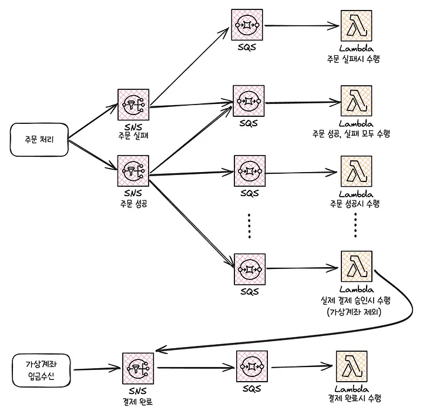

<PostHeader 
  :title="$frontmatter.title"
  :author="$frontmatter.author"
  :date="$frontmatter.date"
/>

## 상황

- 이벤트 피크 타임의 **분당 매출 1억 원, 분당 주문 약 1만 건**을 안정적으로 처리하는 것
- 이벤트 전시 페이지에만 **분당 약 400만 건의 요청(RPM**, Requests Per Minute**)** 초로 환산하면 대략 약 6만 7천 건의 요청(RPS, Requests Per Second)

## 첫 번째. 전시 페이지

- 막대한 읽기(Read) 트래픽을 효율적이고 안정적으로 처리하면서, 핵심적인 **쓰기(Write)** 작업인 주문 시스템을 보호하는 것이 목표

1. **읽기(Read)와 쓰기(Write)의 분리, CQRS 아키텍처 도입**
    - 모놀리식 구조에서는 이벤트가 시작되면 대량의 읽기 요청으로 인해 커넥션 풀이 고갈되어 중요한 쓰기 작업(주문 처리) 불가능해지고 전체 서비스가 마비되는 상황이 반복되었다.
    - 이 문제를 `CQRS` 패턴으로 해결하려 한다.
    - Redis를 이용하여 이벤트에 필요한 모든 상품 데이터(상품명, 가격, 할인가, 이미지 URL 등)를 사전에 가공하여 **머티리얼라이즈드 뷰(Materialized View)** 형태로 별도의 조회 전용 데이터 저장소를 사용한다.
    - 읽기 모델의 **최종적 일관성**은 CDC로 해결. 이로 인해 발생하는 몇 초간의 데이터 지연은, 서비스 전체가 마비될 수 있는 위험을 감수하는 것보다 훨씬 합리적인 비즈니스 **트레이드오프(Trade-off)**
2. **Redis 데이터 압축 최적화**
    - Redis 도입으로 데이터베이스 병목은 해결했지만, 엄청난 양의 데이터 이동으로 인해 **네트워크 대역폭** 과 **Redis 메모리** 사용량 문제가 발생했다.
    - 그렇기에 압축 최적화를 진행, 압축률과 압축/압축해제 속도, CPU 사용률들을 고려해서 압축률이 약간 낮지만 압도적으로 빠른 압축 해제 속도와 낮은 CPU 점유율 → LZ4 알고리즘
3. **캐시 전략**
    - **콜드 스타트** : 캐시가 **완전히 비어있는 상태**에서 시작되어, 초기에는 모든 요청이 캐시 미스(Cache Miss)가 발생하는 문제
    - **캐시 스템피드** : 인기 있는 캐시 키가 **동시에 만료**되었을 때, 여러 요청이 **동일한 데이터를 동시에 조회**하면서 모두 DB에 접근하는 현상
    - 예방 방법 : 캐시 워밍 업, 캐시 만료 시간 분산, 확률적 TTL 갱신, 다단계 캐시, DB 쿼리 비용이 락 대기 비용보다 비싸다면 분산 락도 고려해볼만 함, 멀티 버전 캐시 → 핵심은 일관성을 어느정도로 허용할 수 있는지가 중요하다.
    - **이벤트 시작 수십분 전, 예열 스크립트를 실행하여 가공된 최종 데이터를 캐시에 미리 채워놓기로 해결**

## 두 번째. 주문/재고/쿠폰 시스템 고도화

> [**나야, 주문 - 주문시스템의 도전과 성장 이야기**](https://medium.com/musinsa-tech/%EB%82%98%EC%95%BC-%EC%A3%BC%EB%AC%B8-%EC%A3%BC%EB%AC%B8%EC%8B%9C%EC%8A%A4%ED%85%9C%EC%9D%98-%EB%8F%84%EC%A0%84%EA%B3%BC-%EC%84%B1%EC%9E%A5-%EC%9D%B4%EC%95%BC%EA%B8%B0-744b4bece5b8)

### 문제점

하나의 데이터베이스를 공유하는 모놀리식 아키텍처 한계에 부딪혔다.

1. 주요 도메인들이 하나의 어플리케이션 내에 통합되어 있었기 때문에 복잡하고 유지보수하기 어렵다.
2. DB 의존도가 높아 이벤트로 인해 쓰기 요청이 몰리면 서버가 다운되는 일이 잦았다.
    1. 주문 시 재고 처리를 위해 DB Lock으로 인한 병목도 존재함

### 개선 내용

1. 지속적인 모니터링으로 슬로우 쿼리 개선
2. 레디스 분산 락으로 DB Lock 방식의 한계를 극복
    1. 읽기 요청은 스케일 아웃을 통해 문제를 해결할 수 있었지만, 쓰기 요청은 여러 도메인에서 한 데이터베이스를 사용했기에 쓰기 요청에 대한 병목은 계속 존재함
3. DTO 패턴 적용
4. 일반 MVC 구조에서 DDD 구조 도입

### MSA 도입

주문 시스템은 여러 비즈니스와 연계되어 있어 API 통신의 안정성과 트랜잭션 일관성을 유지할 수 있는 설계가 필수적이였다.

- **장애 전파 방지 및 SAGA 패턴을 통한 분산 트랜잭션 관리**
    - MSA로 전환하면서 많은 기능이 DB 기반에서 API 중심으로 변경되면서, 특정 API 서비스에 장애가 발생하면 다른 서비스로 전파되는 문제가 있었다.
    - 이때 서킷 브레이커 패턴을 적용하여 장애가 발생한 서비스에 대한 호출을 차단했다.
    - 데이터 일관성은 SAGA 패턴으로 실패 보상 트랜잭션을 활용하여 서비스간 의존도를 줄이고, 확장성과 안정성을 강화할 수 있었다.

- **이벤트 기반 아키텍처로의 도약, 리소스 분산**
    - 주문 처리의 성능 최적화를 위해 필수 수행 영역과 비필수 수행 영역을 구분하여, 비필수 영역은 SNS, SQS, Lambda 비동기 처리로 전환했다.
    - SNS → 팬아웃 → (여러 개의) SQS 구독 → 람다
    - **메세지 중복 문제 (멱등성 설계 필요)**
        - 람다 메세지 중복 문제는 Redis의 SETNX를 사용하여 분산 락을 통해 중복 메세지를 방지
    - 오류 처리와 장애 대응을 위해 DLQ를 연결

결과적으로 주문 처리 시스템의 안정성과 성능은 크게 개선되었지만, 이후 연계된 서버리스 기능들에 대해 모니터링과 트러블슈팅 복잡성이 증가하는 새로운 고민이 생김

- **Kafka 도입**
    - 비동기 유즈케이스가 추가될 때 마다 람다가 계속 늘어나서 모니터링과 트러블 슈팅 복잡성이 증가했다.
    - 카프카를 도입하여 람다 컨슈머를 자바 컨슈머로 변환했다.

## 세 번째. **실시간 재고 시스템의 안정성 및 확장성 강화**

> [**재고 서비스의 진화와 혁신: 지속적인 개선을 통한 안정성과 확장성 강화**](https://medium.com/musinsa-tech/%EC%9E%AC%EA%B3%A0-%EC%84%9C%EB%B9%84%EC%8A%A4%EC%9D%98-%EC%A7%84%ED%99%94%EC%99%80-%ED%98%81%EC%8B%A0-%EC%A7%80%EC%86%8D%EC%A0%81%EC%9D%B8-%EA%B0%9C%EC%84%A0%EC%9D%84-%ED%86%B5%ED%95%9C-%EC%95%88%EC%A0%95%EC%84%B1%EA%B3%BC-%ED%99%95%EC%9E%A5%EC%84%B1-%EA%B0%95%ED%99%94-cb851f1ff782)
    
    

한정된 수량의 상품을 구매하기 위해 수천, 수만 명의 사용자가 동시에 몰릴 때, 단순한 `UPDATE inventory SET quantity = quantity - 1` 쿼리는 데이터베이스의 락 경합(Lock Contention)과 데드락(Deadlock)을 유발하며 시스템 전체를 마비시키는 주범이 된다.

성능과 데이터 정합성을 모두 지키기 위해 **다층 방어** 전략을 구축했다.

- **1차. 캐시 계층 : Redis를 활용한 비관적 재고 검사**
    - 사용자의 구매의사가 확정되지 않은 상태(장바구니에 담거나 주문서 페이지에 진입하는 경우)는 레디스의 원자적 연산을 통해 관리
    - 구매 가능성이 낮은 대다수의 트래픽을 효과적으로 걸러냄
    - 재고는 비동기로 업데이트
- **2차. 분산락 : Redlock을 이용한 임계 영역 보호**
    - 데이터베이스 재고를 차감하는 코드 블록을 분산 락으로 감싸놓았기에, 사용자가 결제하기 버튼을 눌러 구매 의사를 확정한 순간 특정 상품에 대한 락을 획득한 스레드만이 코드 블록에 진입할 수 있도록 했다.
    - 이를 통해 동일 상품에 대한 동시 재고 차감 시도를 직렬화하여, 레이스 컨디션(Race Condition)을 원천적으로 방지한다.
- **3차. 데이터베이스 계층 : 낙관적 락을 통한 최종**
    - 분산 락이 완벽하게 동작하지 않을 가능성은 언제나 존재하기에 낙관적 락을 사용
    - 실패한다면 재시도할 수 있도록 처리

## 네 번째. **대용량 트래픽을 위한 쿠폰 시스템 개선**

> [**무신사 성장과 함께 거대해져온 600줄짜리 쿠폰 쿼리와의 아름다운 이별**](https://medium.com/musinsa-tech/%EB%AC%B4%EC%8B%A0%EC%82%AC-%EC%84%B1%EC%9E%A5%EA%B3%BC-%ED%95%A8%EA%BB%98-%EA%B1%B0%EB%8C%80%ED%95%B4%EC%A0%B8%EC%98%A8-600%EC%A4%84%EC%A7%9C%EB%A6%AC-%EC%BF%A0%ED%8F%B0-%EC%BF%BC%EB%A6%AC%EC%99%80%EC%9D%98-%EC%95%84%EB%A6%84%EB%8B%A4%EC%9A%B4-%EC%9D%B4%EB%B3%84-e689d7d932b5)

이 600줄 쿼리는 사용자와 장바구니에 담긴 상품들에 대해 적용 가능한 모든 쿠폰을 실시간으로 계산하는 로직

사용자 정보, 상품, 브랜드, 카테고리, 프로모션 등 수많은 테이블을 `JOIN`하는 이 쿼리는 이벤트 기간에 어김없이 데이터베이스 CPU 사용률을 100%로 치솟게 만드는 주범

상품 상세 페이지에서 최적의 쿠폰을 실시간으로 제공해야하는 요구가 생기면서 이 쿼리를 개선해야 했음

**‘실시간 계산’에서 ‘사전 계산(Pre-computation)’으로의 전환 작업**

1. **쿠폰 인덱서(Coupon Indexer) 도입**
    1. 쿠폰 발급, 프로모션 생성, 사용자 등급 변경 등 쿠폰 적용 조건에 영향을 미치는 모든 이벤트가 발생할 때마다 이를 감지하여 동작하는 백그라운드 서비스를 만듦
    2. 이 인덱서는 모든 쿠폰의 적용 규칙을 미리 분석하고 인덱싱하는 역할을 한다.
2. **Redis를 활용한 머티리얼라이즈드 뷰**
    1. 인덱서의 계산 결과는 Redis에 단순하고 비정규화된 데이터 구조로 저장된다. 
    2. 예를 들어, 특정 쿠폰을 사용할 수 있는 사용자 ID 목록을 담은 `Set` (`coupons:id:applicable_users`), 
    3. 특정 상품에 적용 가능한 쿠폰 ID 목록을 담은 `Set` (`products:id:applicable_coupons`) 등을 미리 만들어 둡니다.
    4. 변화가 많지 않고 자주 요청되는 데이터는 캐시된 정보를 사용하도록 변경 (쿠폰 유형, 회원 등급)
3. **연산의 주체 변경** : DB 연산을 최소화하고 애플리케이션으로 변경
    1. Redis에 몇 번의 간단한 Set 연산을 통해 적용 가능한 모든 쿠폰 목록을 정확하게 찾아낼 수 있도록 한다.

## 생각해볼 점

1. CQRS를 통해 읽기 부하를 분리하였지만 추가적인 고민은 더 있었다.
    1. 최종적 일관성 지키기
    2. 네트워크 대역폭과 메모리 이용량
    3. 캐시 전략
2. 람다로 EDA와 비슷한 비동기를 구현하였지만 관리 포인트가 너무 많이 늘어났기에 카프카로 변경했다.
    1. 메세지 중복 문제 해결 → 멱등성 설계(DB 제약조건 등), 분산 락
    2. 메시지 유실 또는 오류, 장애 대응을 위한 추가적인 방법 → 아웃박스 패턴, DLQ, 공급/소비 전략 설정, 사가, 이벤트소싱
3. Redis의 SETNX
    1. 키 존재 여부 확인 → 존재하지 않으면 값 설정
    2. 이 작업은 중간에 다른 작업이 끼어들 수 없도록 원자적으로 실행된다.
4. CQRS용 머티리얼라이즈드 뷰와 일반적인 캐싱은 목적과 동작 방식이 다르다.
    1. CQRS : 쓰기 시점에 읽기용 데이터 미리 준비 
        1. `[쓰기 요청] → [Command 처리] → [이벤트 발행] → [뷰 갱신] (Redis에 읽기용 데이터 저장)`
        2. 읽기/쓰기 모델 완전 분리
        3. 복잡한 비즈니스 로직을 뷰에 미리 반영하기 때문에 맞춤형 뷰를 제공
    2. 일반 캐싱 : 읽기 시점에 성능 향상을 위한 임시 저장
        1. `[읽기 요청] → [캐시 확인] → [미스 시 DB 조회] → [캐시 저장]`
        2. 쉽게 적용 가능하며, TTL로 자동 일관성 관리
5. 분산 락으로도 완전한 재고 일관성을 지킬 수 없다.
    1. 계층별로 락을 구현
