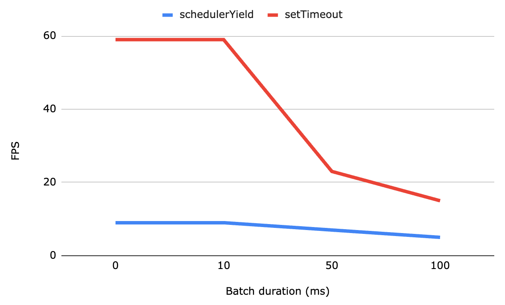

# 배열의 긴 작업 최적화

글: [Breaking Up with Long Tasks or: how I learned to group loops and wield the yield](https://calendar.perfplanet.com/2024/breaking-up-with-long-tasks-or-how-i-learned-to-group-loops-and-wield-the-yield/)

## 유저 경험을 해치는 긴 작업 (Long Tasks)

- 배열은 매우 자주 쓰이는 도구이며, 이를 순회하는 방법은 아주 많음
- 잘못 사용하면 이를 순회하는 대부분의 방법들이 하나의 긴 blocking task를 동기적으로 발생시킴
- 문제는 `for..of`, `forEach`. `map` 과 같은 **자연스러운** 방법들이 잘못된 방법으로 동작함
- 이는 유저에게 응답하지 않는 화면을 제공하고, INP(Interaction to Next Pain)를 느리게 함

## Interaction 반응 최적화

- yielding: 이벤트 루프가 계속 동작하도록 작업을 중단하는 것
- yield 방법
  - delay를 0ms로 설정한 setTimeout
  - 모든 브라우저에서 동작하지 않지만, scheduler.yield
    > scheduler.yield()
    > 현재 실행중인 task를 일시적으로 중단하여 브라우저가 다른 작업을 먼저 진행할 기회를 제공
    > -> 이벤트 루프에게 제어권을 넘김

### forEach는 기다려주지 않아

```js
function handleClick() {
  items.forEach(async (item) => {
    await scheduler.yield();
    process(item);
  });
}
```

- `forEach`는 콜백이 비동기 함수인지 상관하지 않음, yield 실행을 기다리지 않고 배열을 순회함
- exmpale 실행시간: **916.60 ms**

### for..of 는 기다려줘

```js
async function handleClick() {
  for (const item of items) {
    await scheduler.yield();
    process(item);
  }
}
```

- 이제 동작함, 남은건 큰 하나의 작업을 여러개의 작은 작업으로 나누어 interaction시에 바로 반응할 수 있도록 하는 것
- exmpale 실행시간: **1.17 s**

### reduce를 써보자

```js
function handleClick() {
  items.reduce(async (promise, item) => {
    await promise;
    await scheduler.yield();
    process(item);
  }, Promise.resolve());
}
```

- 글쓴이는 만약 함수형 프로그래밍에 대한 집착으로 이 방법을 사용한다면 다시 생각해보라고 함
- 이 방법은 분할한 promise를 다음 순회에 넘긴 것임
- 어쨌든 배열을 동기적으로 순회하며 microtask를 queue에 넣고 있음. 이 순회가 오래 걸린다면 클릭 동작이 느려짐
- exmpale 실행시간: **266.90 ms**

### yield를 못쓰는 상황이면?

```js
async function handleClick() {
  for (const item of items) {
    await Promise((resolve) => setTimeout(resolve, 0));
    process(item);
  }
}
```

- yield 대신 setTimeout을 쓰니 2분 넘게 소요됨!
- 이 큰차이는 [nested timeouts](https://developer.mozilla.org/en-US/docs/Web/API/Window/setTimeout#reasons_for_delays_longer_than_specified)에 의해 생김
  - 브라우저에서 setTimeout이 5번 예약되면 최소 4ms의 delay를 강제 적용함
- exmpale 실행시간: **2.3 min**

## 전체 시간 최적화

- 특정 크기로 적용할 수 있겠지만, 유저 환경에 따라 다르게 동작할 것임
- 소요시간으로 batch 시점 정하기

```js
const BATCH_DURATION = 50;
let timeOfLastYield = performance.now();

function shouldYield() {
  const now = performance.noe();
  if ((now = timeOfLastYield > BATCH_DURATION)) {
    timeOfLastYield = now;
    return true;
  }
  return false;
}

async function handleClick() {
  for (const item of items) {
    if (shouldYield()) {
      await scheduler.yield();
    }
    process(item);
  }
}
```

- yield exmpale 실행시간: **781.80 ms**
- setTimeout exmpale 실행시간: **1.28 s**
- batch 사이즈는 전체 시간을 줄일지, 유저가 기다려야 하는 시간을 줄일지 사이의 tradeoff임

## Smoothness 최적화

- 이전 최적화 단계에서 멈출 수도 있으나 frame rate도 고려해야함
  - setTimeout과 scheduler.yield의 frame rate가 다름
  - 작업을 빨리 끝내야 하는 경우 batch를 키워 yield를 최소화 화면 됨
  - 그러나 시각적으로 보여주는 것이 더 중요한 경우 frame rate를 적당히 유지하는게 좋음
    
- scheduler.yield는 우선 처리되므로 batch를 적용하지 않더라도 frame rate가 낮게 측정됨
- 변경 방안
  - 원하는 프레임 속도에 맞춰 batch duration 조절
  - scheduler.yield를 호출하기전 requestAnimateFrame콜백에서 await promise

```js
const BATCH_DURATION = 1000/ 30; // 30 FPS
let timeOfLastYield = performance.now();

function shouldYield() {
  const now = performance.now();
  if (now - timeOfLastYield > (document.hidden ? 500 : BATCH_DURATION)) {
    timeOfLastYield = now;
    return true;
  }
  retunr false;
}

async function handleClick() {
  for (const item of items) {
    if (shoudYield()) {
      if (document.hidden) {
        await new Promise(resolve => setTimeout(resolve, 1));
        timeOfLastYield = performance.now();
      } else {
        await Promise.race([
          new Promise(resolve => setTimeout(resolve, 100)),
          new Promise(requestAnimationFrame)
        ]);
        timeOfLastYield = performance.now();
        await scheduler.yield();
      }
    }
    process(item);
  }
}
```

- page visibility를 체크해서 유저가 보고있지 않으면 batch 크기를 늘림
- 유저에게 보일 떄는 vercel의 [await-intercation-response](https://vercel.com/blog/demystifying-inp-new-tools-and-actionable-insights#the-implementation) 접근을 인용하여 100 ms보다 느린 requestAnimationFrame는 기다리지 않음

## 느낀 점

- 글쓴이가 마지막에 말한 것처럼 과도한 작업이라고 생각되지만, 유저에게 끼치는 영향을 고려하여 적용해볼만한 작업인 것 같음
- yield를 평소에 잘 쓰지 않고 있었음. scheduler api에 대해서도 알아볼 필요가 있음
  #the-fullswing
