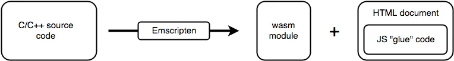

글: [WebAssembly의 개념](https://developer.mozilla.org/ko/docs/WebAssembly/Guides/Concepts)

## 정의

- 최신 웹 브라우저에서 실행할 수 있는 새로운 유형의 코드
- C, C++, RUST 등의 소스 언어를 효과적으로 컴파일하도록 고안됨
- 웹에서 실행되는 클라이언트 응용 프로그램을 사용하여 웹에서 여러 언어로 작성된 코드를 네이티브에 가까운 속도로 실행하는 방법을 제공

## 목표

1. 빠르고, 효과적이고, 이식성이 좋을 것
   - 일반적인 하드웨어들이 제공가는 기능 활용
   - 여러 플랫폼 위에서 거의 네이티브에 가까운 속도로 실행
2. 읽기 쉽고 디버깅이 가능할 것
   - 사람이 충분히 읽을 수 있는 수준의 텍스트 형식 (명세는 아직 검토 중)
3. 안전함을 유지할 것
   - 샌드박싱된 실행환경에서 안전하게 돌아감 -> same-origin과 권한정책을 지켜야함
4. 웹을 망가뜨리지 않을 것
   - 다른 웹 기술과 마찰없이 사용되면서 하위호환성을 관리할 수 있도록 설계됨
     > WebAssembly는 웹과 JavaScript 환경 밖에서도 사용될 것임

## 개념

- 이전에는 JavaScript 만으로 충분했으나 네이티브 성능을 필요로 하는 분야와 큰 애플리케이션에서 성능 문제가 발생됨
- WebAssembly는 JavaScript와 나란히 돌아가면서 부족한 점을 보와하고 강점을 동시에 취함
  - JavaScript는 유연하고 표현력있는 고수준 언어
  - WebAssembly는 네이티브에 가까운 성능
- 필요하면 서로 호출할 수 있음

### 핵심 컨셉

- 모듈
  - 컴파일된 WebAssembly 바이너리
  - stateless, windows와 worker 간에 postMessage로 공유 가능
  - es 모듈과 동일하게 가져오기, 내보내기 선언
- 메모리: ArrayBuffer
- 테이블: 크기 조절 가능한 형식 지정된 배열
- 인스턴스
  - 모듈과 그 모듈이 사용하는 모든 상태의 쌍
  - 메모리, 테이블, 가져온 값의 집합들을 상태로 있음

## 시작

- 현재 초기 단계이기 더 추가되거나 변경될 수 있음
- Emscipten으로 c/c++ 애플리케이션 포팅하기
- 어셈블리 수준에서 바로 WebAssembly를 작성하거나 생성
- Rust 응용 프로그램을 작성하고 WebAssembly를 출력으로 지정
- AssemblyScript를 사용

### C/C++로부터 포팅하기

1. Emscripten은 소스 코드를 clang+LLVM에 넘겨줌
2. Emscripten이 컴파일 결과를 wasm 바이너리로 변환
3. 현재 WebAssembly는 웹 API에 접근하려면 JavaScript를 호출한 다음 웹 API를 호출해야함. 이를 위해 필요한 HTML과 JavsScript glue 코드를 생성함

### WebAssembly를 직접 작성하기

1. WebAssembly text format으로 작성
2. 도구를 사용하여 바이너리로 변환

### Rust로 WebAssembly 작성하기

- Rust로 만들고 WebAssembly로 컴파일할 수 있음

### AssemblyScript

- TypeSciprt와 비슷한 형태로 사용
